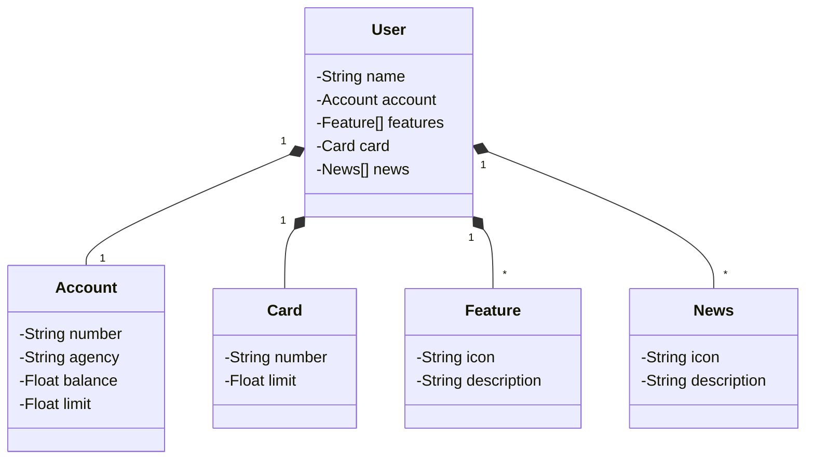

# Santander Dev Week 2023

Java RESTful API created for Santander Dev Week

## Main technologies
  - **Java 17**
  - **Spring Boot 3**
  - **Spring Data JPA**
  - **OpenAPI (Swagger)**
  - **Railway**

## [Figma Link](https://www.figma.com/file/0ZsjwjsYlYd3timxqMWlbj/SANTANDER---Projeto-Web%2FMobile?type=design&node-id=1421%3A432&mode=design&t=6dPQuerScEQH0zAn-1)

Figma was used to abstract the domain of this API, being useful in the analysis and design of the solution

## Class Diagram

